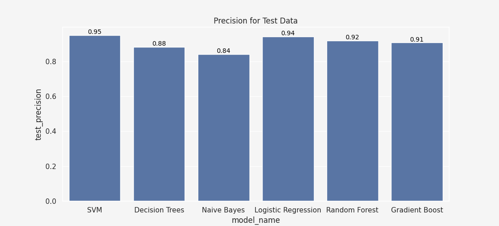
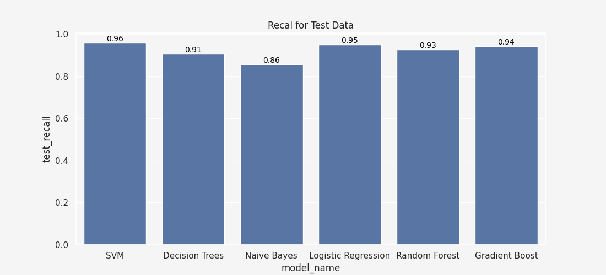
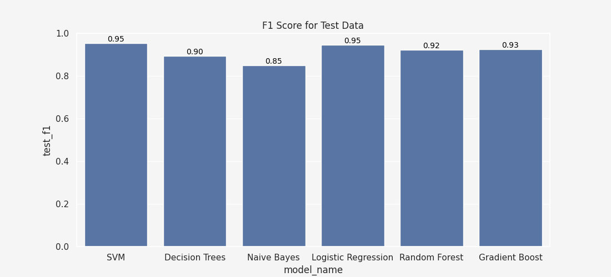
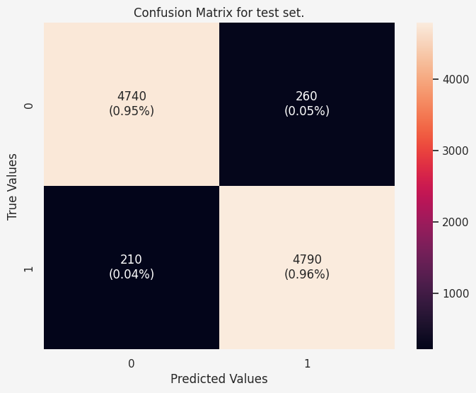

# Reviews-Classification
## Abstract
Some sites you need to know as you go through this work:
- Trustpilot - Trustpilot is a consumer review website that hosts reviews of businesses worldwide. It allows consumers to write and share reviews about their experiences with various businesses, including online retailers, service providers, and other companies.
- Wise and PayPal are money transfer platforms.

This work analyses the customer reviews posted in TrustPilot by users of Wise and PayPal.

Specifically, we will do three things here:
- Scrape TrustPilot reviews made about Wise.com and PayPal,
- Conduct Exploratory Data Analysis (EDA) on data, 
- Conduct review classification using different classifiers in the Sklearn library of Python.

The scraped data is made of:
- 79868 Wise reviews, for which 69042 are positive (4 or 5 stars), and 8999 are negative (1 or 2 stars),
- 19240 PayPal reviews, 1677 are positive, and 17319 are negative,

The scraped data can be downloaded [here](https://drive.google.com/drive/folders/16U3TSFpqKqPle5OLgdGZ5KHQK1UQ7n9n?usp=drive_link).

A sample data point:
```
{'platform': 'Wise',
 'id': '60b8b3f2f9f4870b70161798',
 'stars': 5,
 'title': 'Fast and transparent money transfer!',
 'message': 'Here is the fast, affordable, and transparent international money transfer service. I thoroughly enjoyed it with full satisfaction! Highly recommended.',
 'CompanyReply': None,
 'review_datetime': '2021-06-03T10:50:26',
 'company_reply_datetime': nan}

```

## Root Dir - Files and Folders

1. `Web Scraping and EDA/Scraper.py` - A file. This Python file contains code for scraping review data from [https://www.trustpilot.com/](https://www.trustpilot.com/).
2. `Web Scraping and EDA/eda_wise.ipynb` and `Web Scraping and EDA/eda_paypal2.ipynb` - Files. EDA is done in these files.
3. `Modeling/fitting_models.ipynb` - A file. This is where we fit Sklearn classifiers on the collected data.
4. `models` - A folder. Trained models are saved here.
5. `plots` - A folder. Seaborn plots are saved here.


## Key Findings on EDA
### Wise.com
- The average ratings for Wise.com have been declining Year-on-Year since 2020, registering the biggest hit in 2023, where it has recorded (so far) a 3.5 rating, down from 4.5 in 2022.
- Most reviewers either leave a 5-star or a 1-star; a few customers have mixed feelings (2,3) - they mostly either like Wise or they don't. On average, 86% of the customers left a 5-star or 1-star for Wise in 2022 and 2023.
- Wise replies to reviews left on Trustpilot. Wise.com has improved over time on this front.
- Wise replied to 13.6% of all reviews left between April 2022 and November 2023. The reply rate was 5.1% in 2022 and 20.6% in 2023 YTD.
- The analysis also shows that the chances of Wise replying to a review depend on whether the review is positive or not.
- Wise replied to 44.8% of all negative reviews between April 2022 and November 2023. The reply rate for negative reviews was 37.8% in 2022 and 50.5% in 2023 YTD.
- Wise replied to 2.95% of all positive reviews from April 2022 to November 2023. The reply rate for positive reviews was 0.1% in 2022 and 5.3% in 2023 YTD.
- It takes, on average, 6.8 days for Wise to reply to any review (positive or negative). This time was 7.2 days in 2022 and 6.6 days in 2023. 
- It takes Wise 4.7 days on average to reply to negative reviews. That time was 6.3 days in 2022 and 3.5 days in 2023.
- It takes 19.4 days for Wise to reply to positive reviews in 2023 YTD.

### PayPal.com
- PayPal has had a lot of critics for the past 10 years. The average rating for PayPal is 1.2 out of 5 for 2018 through 2023 YTD.
- PayPal had a good show in 2011 (3.9) and 2012 (4.0). Further investigation shows that PayPal had a descent performance consistently between August 2011 and August 2012.
- As the average rating suggested, most of the PayPal reviewers (~90%) leave a 1 star. 
- PayPal does not respond to any review (positive or negative) on TrustPilot.

## Review Classification Results:

### Accuracy
Accuracy is a metric that measures the overall correctness of the classification model. Specifically, accuracy is defined as the ratio of correctly predicted instances to the total number of cases in the dataset.

<span style="color:red">SVM and Logistic Regression are the best performing classifiers in accuracy of classification.</span>


### Precision and Recall
Precision and recall measure how well the model correctly classifies the positive and negative cases. Read more [here](https://en.wikipedia.org/wiki/Precision_and_recall).

<span style="color:red">SVM is the best performing classifies in terms of Precision and Recall.</span>




### F1 Score
The F1 score is the harmonic mean of the precision and recall [Wikipedia](https://en.wikipedia.org/wiki/F1_score). 

<a href="https://www.codecogs.com/eqnedit.php?latex=\begin{align*}&space;F_1&space;=&space;2\times&space;\frac{\text{precision}\times\text{recall}}{\text{precision}&plus;\text{recall}}&space;\end{align}" target="_blank"></a>

<span style="color:red">SVM and Logistic Regression are the best perfoming classifies for F1 Score.</span>



### Confusion Matrix for the Best Classifier (SVM)

1. True Positive (TP)- The number of instances that were correctly predicted as positive. *Example:* If the model correctly predicts that a review is positive, and the actual label is also positive, it is a true positive.

2. False Positive (FP)- The number of instances that were incorrectly predicted as positive when the actual label is negative. *Example:* If the model predicts that a review is positive, but the actual label is negative, it is a false positive.

3. True Negative (TN) - The number of instances that were correctly predicted as negative. *Example:* If the model correctly predicts that a review is negative, and the actual label is also negative, it is a true negative.

4. False Negative (FN)- The number of instances that were incorrectly predicted as negative when the actual label is positive. *Example:* If the model predicts that a review is negative, but the actual label is positive, it is a false negative.

(0 represents a Positive review, and 1 is Negative, in the Figure below)

SVM classified 4740 positive reviews correctly (FPs) and classified 4790 negative reviews correctly. For error cases, SVM classified 260 positive reviews as negative (FN) and 210 negative cases as positive (FPs).


## Text Test Cases (using SVM classifier)
You can test text cases at the bottom of the notebook.
```Python
a = vectorizer.transform(['Very fun', "Really bad service!!", 'Slow', "Expensive", 
                          "Transfer is quick", "Cheaper than high-street banks"])
print("Prediction",[labels[i] for i in clf_svm.predict(a)])
```

Output:
```
 Prediction ['Positive', 'Negative', 'Negative', 'Negative', 'Positive', 'Positive']
```