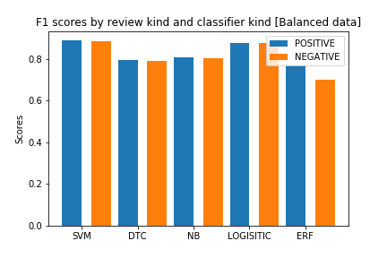

# Reviews-Classification
## Abstract

This repository holds the code and other files used to predict as whether a review is a positive or a negative one. In it, we scrap the data from the web about the reviews made about WorldRemit and classifier reviews using different classifiers in Sklearn library of Python. At the moment of making this post, there are 36456 reviews on the site.

The data available is highly imbalanced: there are so many positive reviews (94% of the training set) than negative(4%) or neutral(2%). So, in this project we fitted the model on the the imbalanced data and also on balanced data (dropped positive excesses so that we have same number of positive and negative reviews.)

For imbalance data model accuracy was ~93% and ~89% for balanced data. The later is better than the former. Check the notebooks to see why.

<table style="width:100%">
  <tr>
    <th></th>
    <th></th>
  </tr>
</table>

A Sample data point:
```
{'socialShareUrl': 'https://www.trustpilot.com/reviews/5ed0251025e5d20a88a2057d', 'businessUnitId': '5090eace00006400051ded85', 'businessUnitDisplayName': 'WorldRemit', 'consumerId': '5ed0250fdfdf8632f9ee7ab6', 'consumerName': 'May', 'reviewId': '5ed0251025e5d20a88a2057d', 'reviewHeader': 'Wow - Great Service', 'reviewBody': 'Wow. Great Service with no issues.  Money was available same day in no time.', 'stars': 5}

```
We will be interested on the `reviewBody` and the number of `stars`.


## Root Dir - Files and Folders

1. `data collection.ipynb` - A file. This notebook contains ways used to scrap the data from the web. [Link](https://www.trustpilot.com/review/www.worldremit.com).
2. `Classifications -  ML comparison_1.ipynb` - A File. This is where we train Sklearn classifiers on imbalanced data.
3. `Classifications -  ML comparison_2.ipynb` - A file. Classifiers trained on balanced data. Better results than those of (2).
4. `data` -  A folder. Contains the data used for this project.
5. `models` - A folder. Trained models are saved here.
6. `plots` - A folder.

## Classifiers and their Results:
| Classifier  |  Accuracy(Balanced data) | Accuracy(Imbalanced data)  |
|---|---|---|
| Support Vector Machine  |  0.889 | 0.958  |
|  Decision Trees | 0.782  |  0.920 |
| Naive Bayes  | 0.784  |  0.924 |
| Logistic Regression   | 0.877  | 0.953  |
| Random Forest   |  0.736 | 0.935  |


**Note:** Models are good on balanced data despite the values shown. Let us see the f1 scores of the models on different classes to get a better understanding.

**Note 2** More explanations are available on the jupyter notebooks on the repository.

### F1 Score
The F1 score is the harmonic mean of the precision and recall [Wikipedia](https://en.wikipedia.org/wiki/F1_score). 

<a href="https://www.codecogs.com/eqnedit.php?latex=\begin{align*}&space;F_1&space;=&space;2\times&space;\frac{\text{precision}\times\text{recall}}{\text{precision}&plus;\text{recall}}&space;\end{align}" target="_blank"></a>

Precision and recall measures how well the model correctly classifiers the positive cases and the negative casses. Read more [here](https://en.wikipedia.org/wiki/Precision_and_recall).

- F1 on imbalanced data:

|  Classisifiers |  F1 Positive | F1 Neutral  | F1 Negative  |
|---|---|---|---|
| Support Vector Machine  | 0.979  | 0.000  | 0.677  |
| Decision Trees  | 0.962  |  0.039 |  0.039 |
| Naive Bayes  |  0.962 |  0.032 |  0.403 |
| Logistic Regression  | 0.976  | 0.000  |  0.590 |
| Random Forest  | 0.966  |  0.000 |  0.000 |


- F1 on balanced data(We only consider two classes):

|  Classisifiers |  F1 Positive | F1 Negative  |
|---|---|---|
| Support Vector Machine  | 0.890  | 0.887  |
| Decision Trees  | 0.785  |  0.778 | 
| Naive Bayes  |  0.789 |  0.778 | 
| Logistic Regression  | 0.878  | 0.876  | 
| Random Forest  | 0.757  |  0.712 | 



## More Plots
- Models accuracies
<table style="width:100%">
  <tr>
    <th></th>
    <th></th>
  </tr>
  </table>
- confusion matrix (svm)
 <table style="width:100%">
  <tr>
    <th></th>
    <th></th>
  </tr>
</table>


## Text test case (using SVM classifier)
```Python
test_set = ['very fun', "Really bad service!!", 'Fast']
new_test = vectorizer.transform(test_set)

clf_svm.predict(new_test)

Ouptut : array(['POSITIVE', 'NEGATIVE', 'POSITIVE'], dtype='<U8')
```

