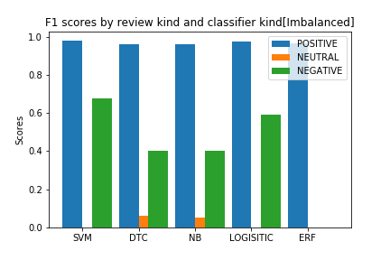
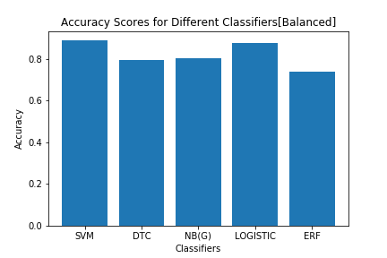

# Reviews-Classification
## Abstract
<<<<<<< HEAD
This repository holds the code and other files used to predict as whether a review is a positive or a negative one. In it, we scrap the data from the web about the reviews made about WorldRemit and classifier reviews using different classifiers in Sklearn library of Python. At the moment of making this post, there are 36456 on the site.

The data available is highly imbalanced: there are so many positive reviews (94% of the training set) than negative(4%) or neutral(2%). So, in this project we fitted the model on the the imbalanced data and also on balanced data (dropped positive excesses so that we have same number of positive and negative reviews.)

For imbalance data model accuracy was ~93% and ~89% for balanced data. The later is better than the former. Check the notebooks to see why.

<table style="width:100%">
  <tr>
    <th></th>
    <th></th>
  </tr>
</table>

A Sample data point:
```
{'socialShareUrl': 'https://www.trustpilot.com/reviews/5ed0251025e5d20a88a2057d', 'businessUnitId': '5090eace00006400051ded85', 'businessUnitDisplayName': 'WorldRemit', 'consumerId': '5ed0250fdfdf8632f9ee7ab6', 'consumerName': 'May', 'reviewId': '5ed0251025e5d20a88a2057d', 'reviewHeader': 'Wow - Great Service', 'reviewBody': 'Wow. Great Service with no issues.  Money was available same day in no time.', 'stars': 5}

```
We will be interested on the `reviewBody` and the number of `stars`.
=======
This repository holds the code and other files used to predict as whether a review is a positive or a negative one. In it, we scrap the data from the web about the reviews made about WorldRemit and classifier reviews using different classifiers in Sklearn library of Python.

The data available is highly imbalance: there are so many positive reviews (94% of the training set) than negative(4%) or neutral(2%). So, in this project we fitted the model on the the imbalanced data and also on balanced data (dropped positive excesses so that we have same number of positive and negative reviews.)

For imbalance data model accuracy was ~93% and ~89% for balanced data. The later is better than the former. Check the notebooks to see why.

[Pic: Data Composition]
>>>>>>> 07875c46eab673f9318996eee8ed59d099c50726

## Root Dir - Files and Folders

1. `data collection.ipynb` - A file. This notebook contains ways used to scrap the data from the web. [Link](https://www.trustpilot.com/review/www.worldremit.com).
2. `Classifications -  ML comparison_1.ipynb` - A File. This is where we train Sklearn classifiers on imbalanced data.
3. `Classifications -  ML comparison_2.ipynb` - A file. Classifiers trained on balanced data. Better results than those of (2).
4. `data` -  A folder. Contains the data used for this project.
5. `models` - A folder. Trained models are saved here.
<<<<<<< HEAD
6. `plots` - A folder.
=======

>>>>>>> 07875c46eab673f9318996eee8ed59d099c50726
## Classifiers and their Results:
| Classifier  |  Accuracy(Balanced data) | Accuracy(Imbalanced data)  |
|---|---|---|
| Support Vector Machine  |  0.889 | 0.958  |
|  Decision Trees | 0.782  |  0.920 |
| Naive Bayes  | 0.784  |  0.924 |
| Logistic Regression   | 0.877  | 0.953  |
| Random Forest   |  0.736 | 0.935  |

**Note:** Models are good on balanced data despite the values shows. Let us see the f1 scores of the models on different classes
<<<<<<< HEAD
### F1 Score
The F1 score is the harmonic mean of the precision and recall [Wikipedia](https://en.wikipedia.org/wiki/F1_score). 

<a href="https://www.codecogs.com/eqnedit.php?latex=\begin{align*}&space;F_1&space;=&space;2\times&space;\frac{\text{precision}\times\text{recall}}{\text{precision}&plus;\text{recall}}&space;\end{align}" target="_blank"></a>

Precision and recall measures how well the model correctly classifiers the positive cases and the negative casses. Read more [here](https://en.wikipedia.org/wiki/Precision_and_recall).

- F1 on imbalanced data:

|  Classisifiers |  F1 Positive | F1 Neutral  | F1 Negative  |
|---|---|---|---|
| Support Vector Machine  | 0.979  | 0.000  | 0.677  |
| Decision Trees  | 0.962  |  0.039 |  0.039 |
| Naive Bayes  |  0.962 |  0.032 |  0.403 |
| Logistic Regression  | 0.976  | 0.000  |  0.590 |
| Random Forest  | 0.966  |  0.000 |  0.000 |



- F1 on balanced data(We only consider two classes):

|  Classisifiers |  F1 Positive | F1 Negative  |
|---|---|---|
| Support Vector Machine  | 0.890  | 0.887  |
| Decision Trees  | 0.785  |  0.778 | 
| Naive Bayes  |  0.789 |  0.778 | 
| Logistic Regression  | 0.878  | 0.876  | 
| Random Forest  | 0.757  |  0.712 | 


## More Plots
- Models accuracies
<table style="width:100%">
  <tr>
    <th></th>
    <th></th>
  </tr>
  </table>
- confusion matrix (svm)
 <table style="width:100%">
  <tr>
    <th></th>
    <th></th>
  </tr>
</table>


## Text test case (using SVM classifier)
```Python
test_set = ['very fun', "Really bad service!!", 'Fast']
new_test = vectorizer.transform(test_set)

clf_svm.predict(new_test)

Ouptut : array(['POSITIVE', 'NEGATIVE', 'POSITIVE'], dtype='<U8')
```

=======


[](https://nodesource.com/products/nsolid)

# Dillinger

[](https://nodesource.com/products/nsolid)

[](https://travis-ci.org/joemccann/dillinger)

Dillinger is a cloud-enabled, mobile-ready, offline-storage, AngularJS powered HTML5 Markdown editor.

  - Type some Markdown on the left
  - See HTML in the right
  - Magic

# New Features!

  - Import a HTML file and watch it magically convert to Markdown
  - Drag and drop images (requires your Dropbox account be linked)


You can also:
  - Import and save files from GitHub, Dropbox, Google Drive and One Drive
  - Drag and drop markdown and HTML files into Dillinger
  - Export documents as Markdown, HTML and PDF

Markdown is a lightweight markup language based on the formatting conventions that people naturally use in email.  As [John Gruber] writes on the [Markdown site][df1]

> The overriding design goal for Markdown's
> formatting syntax is to make it as readable
> as possible. The idea is that a
> Markdown-formatted document should be
> publishable as-is, as plain text, without
> looking like it's been marked up with tags
> or formatting instructions.

This text you see here is *actually* written in Markdown! To get a feel for Markdown's syntax, type some text into the left window and watch the results in the right.

### Tech

Dillinger uses a number of open source projects to work properly:

* [AngularJS] - HTML enhanced for web apps!
* [Ace Editor] - awesome web-based text editor
* [markdown-it] - Markdown parser done right. Fast and easy to extend.
* [Twitter Bootstrap] - great UI boilerplate for modern web apps
* [node.js] - evented I/O for the backend
* [Express] - fast node.js network app framework [@tjholowaychuk]
* [Gulp] - the streaming build system
* [Breakdance](https://breakdance.github.io/breakdance/) - HTML to Markdown converter
* [jQuery] - duh

And of course Dillinger itself is open source with a [public repository][dill]
 on GitHub.

### Installation

Dillinger requires [Node.js](https://nodejs.org/) v4+ to run.

Install the dependencies and devDependencies and start the server.

```sh
$ cd dillinger
$ npm install -d
$ node app
```

For production environments...

```sh
$ npm install --production
$ NODE_ENV=production node app
```

### Plugins

Dillinger is currently extended with the following plugins. Instructions on how to use them in your own application are linked below.

| Plugin | README |
| ------ | ------ |
| Dropbox | [plugins/dropbox/README.md][PlDb] |
| GitHub | [plugins/github/README.md][PlGh] |
| Google Drive | [plugins/googledrive/README.md][PlGd] |
| OneDrive | [plugins/onedrive/README.md][PlOd] |
| Medium | [plugins/medium/README.md][PlMe] |
| Google Analytics | [plugins/googleanalytics/README.md][PlGa] |


### Development

Want to contribute? Great!

Dillinger uses Gulp + Webpack for fast developing.
Make a change in your file and instantaneously see your updates!

Open your favorite Terminal and run these commands.

First Tab:
```sh
$ node app
```

Second Tab:
```sh
$ gulp watch
```

(optional) Third:
```sh
$ karma test
```
#### Building for source
For production release:
```sh
$ gulp build --prod
```
Generating pre-built zip archives for distribution:
```sh
$ gulp build dist --prod
```
### Docker
Dillinger is very easy to install and deploy in a Docker container.

By default, the Docker will expose port 8080, so change this within the Dockerfile if necessary. When ready, simply use the Dockerfile to build the image.

```sh
cd dillinger
docker build -t joemccann/dillinger:${package.json.version} .
```
This will create the dillinger image and pull in the necessary dependencies. Be sure to swap out `${package.json.version}` with the actual version of Dillinger.

Once done, run the Docker image and map the port to whatever you wish on your host. In this example, we simply map port 8000 of the host to port 8080 of the Docker (or whatever port was exposed in the Dockerfile):

```sh
docker run -d -p 8000:8080 --restart="always" <youruser>/dillinger:${package.json.version}
```

Verify the deployment by navigating to your server address in your preferred browser.

```sh
127.0.0.1:8000
```

#### Kubernetes + Google Cloud

See [KUBERNETES.md](https://github.com/joemccann/dillinger/blob/master/KUBERNETES.md)


### Todos

 - Write MORE Tests
 - Add Night Mode

License
----

MIT


**Free Software, Hell Yeah!**

[//]: # (These are reference links used in the body of this note and get stripped out when the markdown processor does its job. There is no need to format nicely because it shouldn't be seen. Thanks SO - http://stackoverflow.com/questions/4823468/store-comments-in-markdown-syntax)


   [dill]: <https://github.com/joemccann/dillinger>
   [git-repo-url]: <https://github.com/joemccann/dillinger.git>
   [john gruber]: <http://daringfireball.net>
   [df1]: <http://daringfireball.net/projects/markdown/>
   [markdown-it]: <https://github.com/markdown-it/markdown-it>
   [Ace Editor]: <http://ace.ajax.org>
   [node.js]: <http://nodejs.org>
   [Twitter Bootstrap]: <http://twitter.github.com/bootstrap/>
   [jQuery]: <http://jquery.com>
   [@tjholowaychuk]: <http://twitter.com/tjholowaychuk>
   [express]: <http://expressjs.com>
   [AngularJS]: <http://angularjs.org>
   [Gulp]: <http://gulpjs.com>

   [PlDb]: <https://github.com/joemccann/dillinger/tree/master/plugins/dropbox/README.md>
   [PlGh]: <https://github.com/joemccann/dillinger/tree/master/plugins/github/README.md>
   [PlGd]: <https://github.com/joemccann/dillinger/tree/master/plugins/googledrive/README.md>
   [PlOd]: <https://github.com/joemccann/dillinger/tree/master/plugins/onedrive/README.md>
   [PlMe]: <https://github.com/joemccann/dillinger/tree/master/plugins/medium/README.md>
   [PlGa]: <https://github.com/RahulHP/dillinger/blob/master/plugins/googleanalytics/README.md>
>>>>>>> 07875c46eab673f9318996eee8ed59d099c50726
